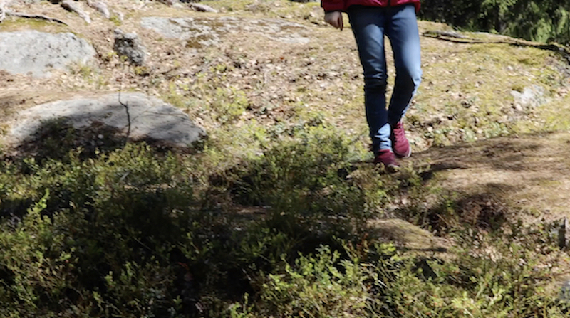

# Coding Nature

*Eliding code with multimodal composition methods to facilitate experiential learning in nature*
&nbsp;

## Act 1: Undiscipling Environmental Education

### Multimodal Installation Project

In Finland there is no concept of Environmental Education

* what are nature schools?
* what happens at nature schools?
* what are the connections between environmental knowledge and environmental policy?

[Film Clip](https://youtu.be/P0ZLPQHUHEo) :clapper: 

[Project Link](https://sites.pitt.edu/~sjq4/UnDisciplining/) 

&nbsp;

### STEM Multimodal Communication Course

* journaling
* image capture
* sound capture
* video capture
* interviewing
&nbsp;

## Act 2: Intro to basic coding and Open Fuego

**Dilemma  of knowledge, authority, and power** *Who knows? Who decides who knows? Who decides who decides?* from Shoshona Zubhoff's *In the Age of The Smart Machines*

* should everyone know a little about code?
* if so, what is our responsibility  as educators?
* what other forces are at play? 

[Open Fuego Intro](https://sjquigley.github.io/Open-Fuego-Presentation/)

[Open Fuego Coding Tools](https://open-fuego.github.io/Open-Fuego-Coding-Tools/)
&nbsp;

## Act 3: My Nature Outing

* is there value in combining code + multimodal methods + environmental science?
* how can I better recognize indigenous  knowledge/methods?
* how does this scale?

[My Nature Study](https://sites.pitt.edu/~sjq4/)

[Student Sample 1](https://sjquigley.github.io/My-Nature-Outing-Sample-Student-1/)

[Student Sample 2](https://sjquigley.github.io/My-Nature-Outing-Sample-Student-2/)

&nbsp;

## Additional Readings

Haas, A. M. (2007). Wampum as hypertext: An American Indian intellectual tradition of multimedia theory and practice. Studies in American Indian Literatures, 19(4), 77-100.
[Article Link](https://muse.jhu.edu/article/235980/pdf?casa_token=W-stWt_zlw0AAAAA:CZxAmH_UXmo1CdbpJr3447_hix9HWZdIK3wjEIRHh13L5GX0WT7wgS-_Y3TcLhwqHuhX7-AqL6o)

Quigley, S. J. (2002) Basic coding. Kairos. A journal of Rhetoric, Technology, and Pedagogy 26(2). [Article Link](https://kairos.technorhetoric.net/26.2/disputatio/quigley/index.html)

Stolley, Karl. (2016). The lo-fi manifesto, v. 2.0. Kairos: A Journal of Rhetoric, Technology, and Pedagogy 20(2).
[Article Link](https://kairos.technorhetoric.net/20.2/inventio/stolley/)

&nbsp;

## Resources
- [Best Practices for Collaborating on GitHub](https://github.com/sjquigley/GitHub-in-the-Tech-Comm-Classroom)
- [Open Fuego FAQ/Teaching Best Practices](https://open-fuego.github.io/Open-Fuego-Coding-Tools/) (scroll to the bottom of the page to find FAQ and Best Practices)
- [W3](https://www.w3schools.com) provides a wide range of code reference, tutorials, and a sandbox allowing code play.
- [Stack Overflow](https://stackoverflow.com) Code questions and aggregated answers.

